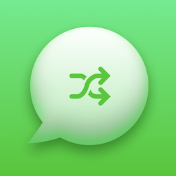
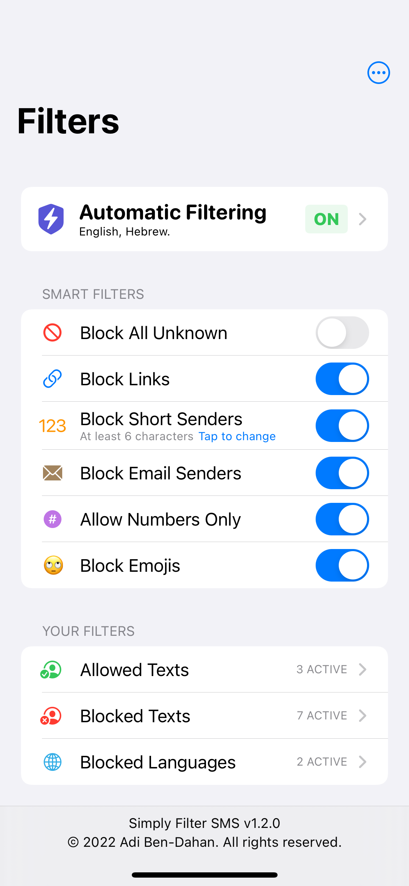
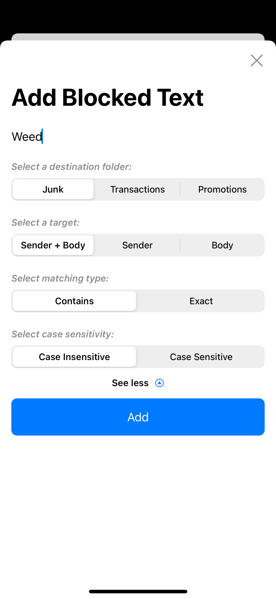
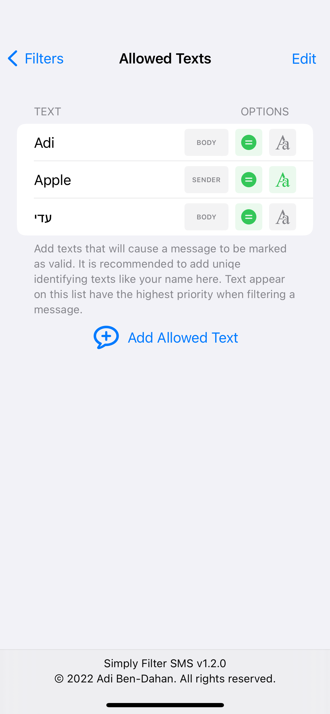
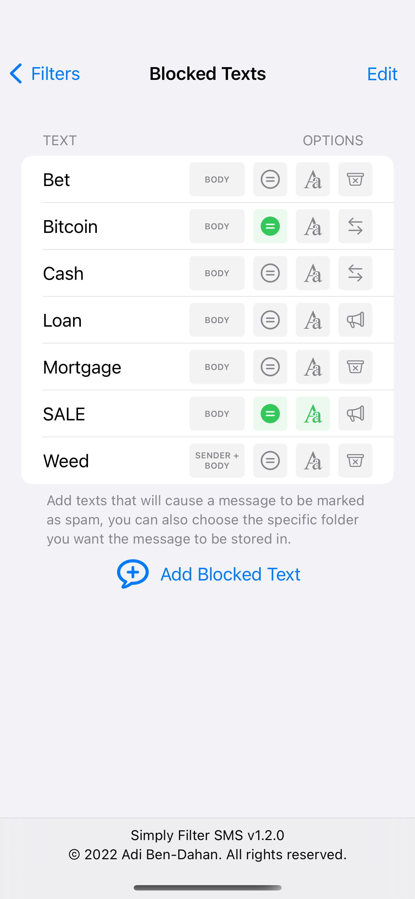
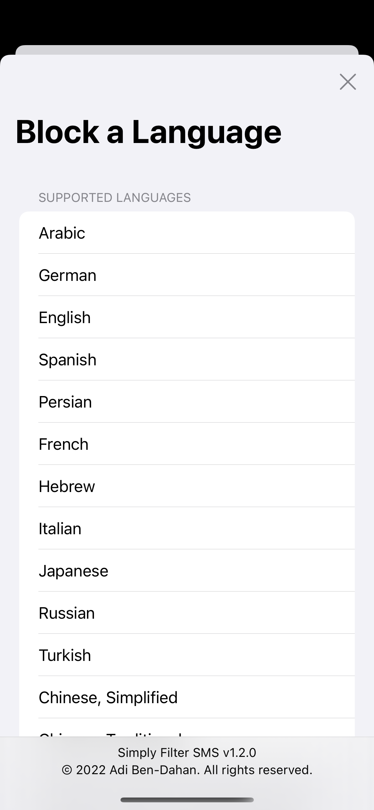
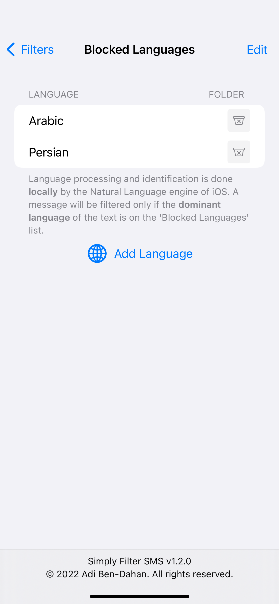

  
  <h1>Simply Filter SMS</h1>
  

    <b>Simply filter text messages from unknown senders using keywords</b>
  

   
   
   

[![Contributors][contributors-shield]][contributors-url]
[![Forks][forks-shield]][forks-url]
[![Stargazers][stars-shield]][stars-url]
[![Issues][issues-shield]][issues-url]
[![MIT License][license-shield]][license-url]

Simply Filter SMS is a private, free and fast way to filter out spam text messages on iPhones.

## Download

### iOS

Requires iOS 15 or later.

## Features

### User Defined Filters
You can add your filters to allow/deny any specific text.

### Automatic Filtering
Enabling it will filter messages using a pre defined list of terms (English/Hebrew only).

### Smart Filters
Easily filter messages from short/email/all unknown senders, containing links/emojis or allow sender with phone numbers only. 

### Block Languages
Easily block all text messages in any specific language(s). 

## Why choose Simply Filter SMS?

### Private
Simply Filter SMS does not collect any data whatsoever. Nothing leaves your device.

### Free
Everything is free of charge. Forever. No in-app purchases, no nonsense. 

### Fast
The app is primarily a host of rules that integrates with iOS in a native, lightweight way, making the filtering efficient and fast.

### Open Source
The source code is published under the permissive MIT license.

### Modern
Simply Filter SMS is written in Apple's latest programming paradigm SwiftUI.

## Screenshots

## FAQ

#### ***How does message filtering work?***

When you recive a text message from a number that is not in your contact list, Simply Filter SMS will filter it based on the following rules:
* If a text message contains text matching to a filter from the 'Allowed Texts' it will be delivered regularly.
* If not, the message will be scanned for matching filters from the 'Blocked Texts' and in case any were found it will be delivered to the Junk folder.
*  If the text doesn't contain any text that matches the filters, it will be delivered regularly.

#### ***Are my messages exposed to the app developer?***

No. Simply Filter SMS does not collect any information whatsoever, all message processing is done locally on your device without any logging.

#### ***What about iMessages and messages from my contacts?***

Apple does not expose those messages to any developer, they remain completely private.

#### ***Where are the filtered messages?***

When a text message is tagged as junk it will still be available for reading on the Messages app under the Junk folder.

#### ***What's the difference between Junk/Transactions/Promotions folders?***

Not much, you can filter any word to any folder. Those folders are not customable in any way. Only messages filtered to the Junk folder will be delivered silently.

#### ***How does Automatic Filtering work?***

Automatic Filtering is using a pre defined list of terms to determine if a message should be sent to the Junk folder or not. The lists are updated periodically with new terms. Your regular filters are still considered when Automatic Filtering is on.

## Building from source

Just open the project on Xcode and build (Xcode >= 13.2.1). 

## Contributing

Simply Filter SMS is open for pull-request business.

## License

[MIT](https://github.com/adibendahan/SimplyFilterSMS-iOS/blob/main/LICENSE) 2025 © Adi Ben-Dahan. All rights reserved.

[contributors-shield]: https://img.shields.io/github/contributors/adibendahan/SimplyFilterSMS-iOS?style=for-the-badge
[contributors-url]: https://github.com/adibendahan/SimplyFilterSMS-iOS/graphs/contributors
[forks-shield]: https://img.shields.io/github/forks/adibendahan/SimplyFilterSMS-iOS?style=for-the-badge
[forks-url]: https://github.com/adibendahan/SimplyFilterSMS-iOS/network/members
[stars-shield]: https://img.shields.io/github/stars/adibendahan/SimplyFilterSMS-iOS?style=for-the-badge
[stars-url]: https://github.com/adibendahan/SimplyFilterSMS-iOS/stargazers
[issues-shield]: https://img.shields.io/github/issues/adibendahan/SimplyFilterSMS-iOS?style=for-the-badge
[issues-url]: https://github.com/adibendahan/SimplyFilterSMS-iOS/issues
[license-shield]: https://img.shields.io/github/license/adibendahan/SimplyFilterSMS-iOS?style=for-the-badge
[license-url]: https://github.com/adibendahan/SimplyFilterSMS-iOS/blob/main/LICENSE
